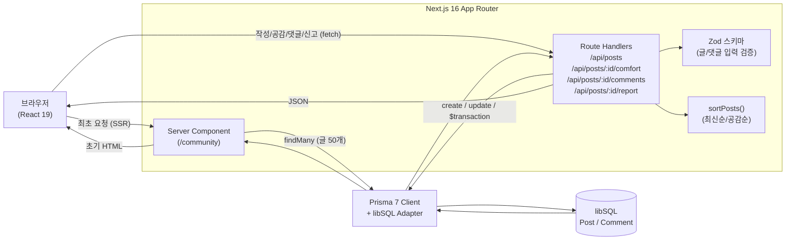

# 여백 (Yeobaek)

> 가족을 떠나보낸 직후, 무엇을 언제까지 해야 하는지 상황에 맞춰 한 걸음씩 안내하는 한국형 사후 절차 길잡이.
> 장례부터 행정, 보험·연금·지원금, 상속, 세금, 조문 예절까지 흩어진 정보를 한 곳에 모았습니다.


---

## 이런 문제를 풀었습니다

가족을 떠나보낸 유족은 슬퍼할 겨를도 없이 절차의 벽에 부딪힙니다.
자택에서 임종한 경우 경찰 검안이 먼저라는 것, 사망진단서를 넉넉히 떼어 둬야 한다는 것,
안심상속 원스톱으로 숨은 계좌·보험을 찾을 수 있다는 것, 자동차는 6개월 안에 이전해야 과태료가 없다는 것.
이런 정보는 흩어져 있고, 검색하면 광고와 단편 정보뿐입니다.

여백은 **"지금 무엇부터, 언제까지 해야 하는지"** 를 사용자의 상황(임종 장소, 가족 구성, 사망일)에 맞춰
순서대로 정리해 주는 것을 목표로 만든 서비스입니다.

## 주요 기능

실제 구현된 9개 페이지로 구성되어 있습니다.

| 기능 | 설명 |
|---|---|
| **유족 길잡이** (`/family-guide`) | 6단계 할 일을 체크리스트로 제공. 사망일을 입력하면 사망신고·상속·상속세 등 법정 기한을 **D-day**로 계산. 임종 장소·수급자 여부에 따라 필요한 항목만 노출하고, 진행률은 `localStorage`에 저장 |
| **빚 상속 진단** (`/debt-simulator`) | 3개 질문(재산/빚 비중, 파악 여부, 상속인 수)에 답하면 단순승인·한정승인·상속포기 조합을 자동 판정. 실제 신청 절차·준비 서류·기한까지 안내 |
| **상속 가이드** (`/inheritance`) | 상속 순위·법정상속분·재산 분할·유류분·등기/세금을 목차 기반으로 정리. Article 구조화 데이터(JSON-LD) 포함 |
| **상속세 계산기** (`/inheritance-tax`) | 재산·부채·배우자 유무를 입력하면 누진세율표 기반으로 예상 상속세를 간이 추정 |
| **부고 생성기** (`/obituary`) | 빈칸만 채우면 단정한 부고 문구를 만들어 클립보드로 복사 |
| **조문 예절** (`/etiquette`) | 입관 전후, 분향·헌화·절, 부의금, 종교별 예절, FAQ까지 여러 섹션 |
| **용어 사전** (`/terms`) | 장례·안치·상속·보험 등 카테고리별 용어를 검색·필터 |
| **지원금** (`/support`) | 국민연금 유족연금/사망일시금, 장제급여, 산재·보훈 등 지원 제도와 신청처·기한 |
| **커뮤니티** (`/community`) | 익명으로 고민과 위로를 나누는 게시판. 댓글·공감·신고·정렬이 동작하는 **실제 백엔드** (아래 참고) |

### 커뮤니티에서 동작하는 것

정적 정보 페이지와 달리, 커뮤니티는 DB에 읽고 쓰는 풀스택 기능입니다.

- **글 작성**: 태그·제목·본문을 Zod로 검증한 뒤 저장
- **위로(공감)**: 글마다 공감 수를 누적. 한 번만 누를 수 있게 클라이언트에서 막음
- **댓글**: 글을 펼치면 댓글을 지연 로드하고, 작성 시 글의 답변 수를 트랜잭션으로 함께 증가
- **신고**: 글마다 신고 수를 누적. 임계치(`REPORT_HIDE_THRESHOLD = 5`) 이상이면 목록에서 흐리게 처리하고 "운영진 검토 중" 안내 표시
- **정렬**: 최신순 / 공감순 전환 (`sortPosts` 순수 함수, 단위테스트 대상)
- **빈 상태**: 글이 없거나 필터 결과가 없을 때, 댓글이 없을 때 각각 안내 문구 제공

## 기술 스택

| 카테고리 | 사용 기술 |
|---|---|
| **프레임워크** | Next.js 16 (App Router) · React 19 · TypeScript 5 |
| **데이터베이스 / ORM** | Prisma 7 + `@prisma/adapter-libsql` · libSQL (로컬 SQLite 파일 / 프로덕션 Turso) |
| **스타일링** | Tailwind CSS v4 (`@theme` 디자인 토큰) · Noto Serif KR + Pretendard |
| **검증** | Zod 4 (API 입력 런타임 검증) |
| **테스트** | Vitest (순수 로직 단위테스트 45개) |
| **아이콘** | lucide-react |

## 아키텍처

커뮤니티는 정적 정보 페이지와 달리 **서버 렌더링 + 명시적 API 쓰기**로 구성했습니다.



**요청 흐름**

- **최초 진입(SSR)**: `/community` 서버 컴포넌트가 요청 시점에 Prisma로 글 50개를 읽어(`force-dynamic`) 첫 화면을 렌더링하고, `Date`는 ISO 문자열(`PostDTO`)로 직렬화해 클라이언트로 전달.
- **정렬**: 최신순/공감순 전환은 클라이언트에서 `sortPosts()`로 처리(공감 동률이면 최신순으로 타이브레이크). 같은 정렬 로직을 `GET /api/posts`의 `orderBy`로도 제공.
- **글 작성**: 클라이언트 컴포넌트가 `POST /api/posts`로 전송. Route Handler가 Zod로 검증한 뒤 `prisma.post.create`. 응답으로 받은 글을 목록 맨 앞에 즉시 추가.
- **위로 누르기(낙관적 업데이트)**: 클릭 즉시 UI에 `comfort + 1`을 반영하고 `POST /api/posts/:id/comfort` 호출. 실패하면 카운트와 좋아요 상태를 **롤백**.
- **댓글**: 글을 펼칠 때 `GET /api/posts/:id/comments`로 지연 로드. 작성은 낙관적으로 임시 댓글을 먼저 보여 주고 `POST`로 전송, 성공하면 서버 응답으로 치환하고 실패하면 제거. 서버는 댓글 생성과 글의 답변 수(`reply`) 증가를 `$transaction`으로 묶음.
- **신고**: `POST /api/posts/:id/report`로 신고 수(`reported`)를 누적. 임계치를 넘으면 해당 글을 흐리게 처리해 운영 검토 대상임을 알림.

## 기술적으로 신경 쓴 점

1. **Prisma 7 driver adapter (libSQL)로 서버리스 대응**
   Prisma 7은 driver adapter가 기본이라 Rust 쿼리 엔진 바이너리 없이 동작합니다. libSQL 어댑터 하나(`lib/db.ts`)로 **로컬 SQLite 파일(`file:`)과 원격 Turso(`libsql://`)를 동일 코드로** 처리하고, 개발 핫리로드 시 커넥션이 무한 생성되지 않도록 `globalThis` 싱글톤으로 묶었습니다. Vercel 서버리스 파일시스템은 휘발성이라 SQLite 파일로는 쓰기가 영속되지 않는데, SQLite 호환이면서 원격 영속이 되는 Turso로 이 문제를 해결했습니다.

2. **SSR + 클라이언트 낙관적 업데이트**
   첫 페인트는 서버 컴포넌트의 SSR로 빠르게 그리고, 변경은 명시적 REST 엔드포인트로 분리했습니다. 위로·댓글·신고는 낙관적으로 즉시 반영하고 실패 시 롤백해 체감 반응성과 정합성을 함께 챙겼습니다. 댓글 작성처럼 두 테이블을 함께 바꾸는 작업은 `prisma.$transaction`으로 일관성을 보장합니다.

3. **Zod 런타임 입력 검증**
   `lib/posts.ts`에 글 작성 스키마(`createPostSchema`)와 댓글 스키마(`createCommentSchema`)를 정의하고 API에서 `safeParse`로 검증합니다. 실패 시 사람이 읽을 수 있는 메시지와 함께 `422`를, JSON 파싱 실패엔 `400`을 반환합니다. 스키마에서 `z.infer`로 입력 타입을 도출해 검증 규칙과 타입이 한 곳에서 일치합니다.

4. **순수 로직 분리 + 단위테스트(Vitest 45개)**
   UI에 섞이기 쉬운 계산·판정 로직을 순수 함수로 떼어 내 테스트했습니다. D-day 계산(`lib/dday.ts`), 빚 상속 판정(`lib/debt.ts`), 상속세 추정(`lib/tax.ts`), 게시글 정렬·입력 검증(`lib/posts.ts`)을 각각 검증하며, 세율 구간 경계·공제 적용·정렬 타이브레이크·검증 경계값 같은 까다로운 케이스를 다룹니다.

5. **SEO / 공유 메타데이터**
   `app/sitemap.ts`(우선순위·갱신주기 부여), `app/robots.ts`(`/api/` 차단), 동적 OG 이미지(`app/opengraph-image.tsx`, Google Fonts에서 한글 폰트를 받아 시그니처를 검증하고 실패 시 영문 폴백)를 갖췄습니다. 구조화 데이터는 `components/JsonLd.tsx`로 `<script type="application/ld+json">`을 안전하게 렌더하며, 루트 레이아웃에 WebSite, 상속 가이드에 Article 스키마를 적용했습니다.

6. **Tailwind v4 `@theme` 디자인 토큰**
   `app/globals.css`의 `@theme` 블록에 색·폰트를 토큰으로 중앙화해 "Warm & Soft"(한지 크림 + 클레이 톤) 일관성을 유지하고, `:focus-visible` 포커스 링과 `prefers-reduced-motion` 분기로 접근성을 고려했습니다.

## 로컬 실행

```bash
pnpm install                 # postinstall이 prisma generate 수행
cp .env.example .env         # 기본값이 file: 모드라 그대로 동작
pnpm db:push                 # 로컬 SQLite에 스키마 적용
pnpm db:seed                 # 예시 글·댓글 시드 (이미 글이 있으면 건너뜀)
pnpm dev                     # http://localhost:3000
```

자주 쓰는 스크립트

| 명령 | 설명 |
|---|---|
| `pnpm dev` | 개발 서버 |
| `pnpm build` | `prisma generate && next build` |
| `pnpm test` | Vitest 단위테스트 실행 (45개) |
| `pnpm lint` | ESLint |
| `pnpm db:push` | 스키마를 DB에 반영 |
| `pnpm db:migrate` | 마이그레이션 생성·적용 |
| `pnpm db:seed` | 시드 데이터 삽입 |
| `pnpm db:studio` | Prisma Studio (데이터 GUI) |

## 폴더 구조

```text
yeobaek/
├── app/
│   ├── page.tsx                 # 홈 (히어로 + 기능 그리드)
│   ├── layout.tsx               # 루트 레이아웃 + 메타데이터 + WebSite JSON-LD
│   ├── globals.css              # Tailwind v4 @theme 디자인 토큰
│   ├── sitemap.ts               # 동적 사이트맵
│   ├── robots.ts                # robots.txt (/api/ 차단)
│   ├── opengraph-image.tsx      # 동적 OG 이미지 (한글 폰트 + 영문 폴백)
│   ├── family-guide/            # 유족 길잡이 (체크리스트 + D-day)
│   ├── debt-simulator/          # 빚 상속 진단
│   ├── inheritance/             # 상속 가이드 (+ Article JSON-LD)
│   ├── inheritance-tax/         # 상속세 계산기
│   ├── obituary/                # 부고 생성기
│   ├── etiquette/               # 조문 예절
│   ├── terms/                   # 용어 사전
│   ├── support/                 # 지원금
│   ├── community/page.tsx       # 커뮤니티 (SSR)
│   └── api/
│       └── posts/
│           ├── route.ts                 # GET 목록(태그·정렬) / POST 작성
│           └── [id]/
│               ├── comfort/route.ts     # POST 위로 +1
│               ├── comments/route.ts    # GET 댓글 목록 / POST 댓글 작성
│               └── report/route.ts      # POST 신고 +1
├── components/
│   ├── Header.tsx · Footer.tsx
│   ├── CommunityBoard.tsx       # 작성·필터·정렬·공감·댓글·신고 (낙관적 업데이트)
│   ├── JsonLd.tsx               # 구조화 데이터 렌더러
│   └── Reveal.tsx               # 스크롤 등장 애니메이션
├── lib/
│   ├── db.ts                    # Prisma + libSQL 싱글톤
│   ├── posts.ts                 # Zod 스키마 · PostDTO/CommentDTO · sortPosts
│   ├── dday.ts                  # 법정 기한 D-day 계산 (순수 로직)
│   ├── debt.ts                  # 빚 상속 판정 (순수 로직)
│   ├── tax.ts                   # 상속세 간이 계산 (순수 로직)
│   ├── *.test.ts                # Vitest 단위테스트 (dday·debt·tax·posts)
│   ├── terms.ts · nav.ts        # 용어 데이터 · 내비게이션
│   └── generated/prisma/        # Prisma Client (생성물)
└── prisma/
    ├── schema.prisma            # Post · Comment 모델
    ├── seed.ts                  # 시드 스크립트 (글 + 댓글)
    └── migrations/
```

## 데이터 모델

```text
Post   id · tag · title · body · comfort · reply · reported · createdAt
         └─ comments (1:N)
Comment id · postId · body · createdAt
```

`reply`는 댓글 작성 시 트랜잭션으로 함께 증가시켜 댓글 수와 일관되게 유지하고, `reported`는 신고 누적 수로 임계치 이상이면 목록에서 흐리게 처리합니다.

## 콘텐츠 신뢰성과 한계

법적 기한·제도(보험금 청구시효 3년, 국민연금 5년, 자동차 상속이전 6개월, 상속포기·한정승인 3개월 등)는 검증해 반영했으나,
제도·금액·기한은 바뀔 수 있고 개인 상황마다 다릅니다.
법률·세무 판단이 필요한 부분에는 전문가 상담 권고를 함께 담았으며, 본 서비스는 정보 제공이며 자문을 대체하지 않습니다.
